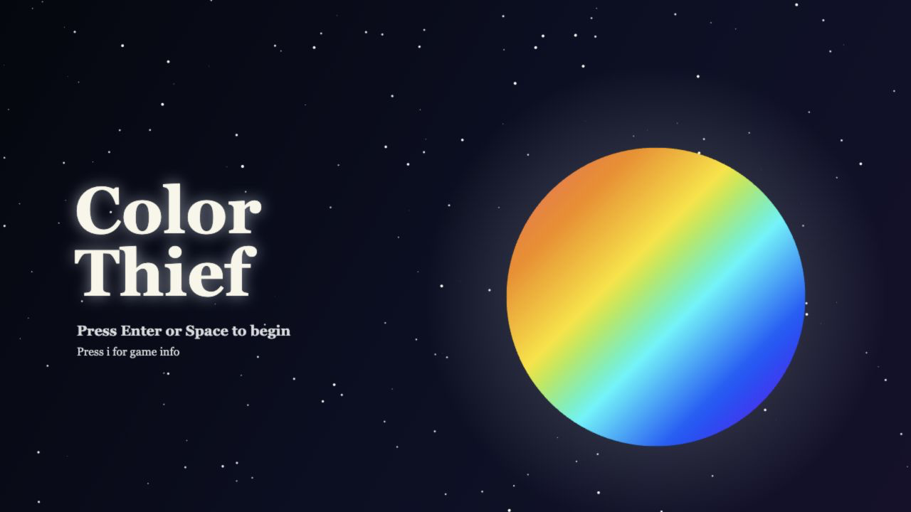
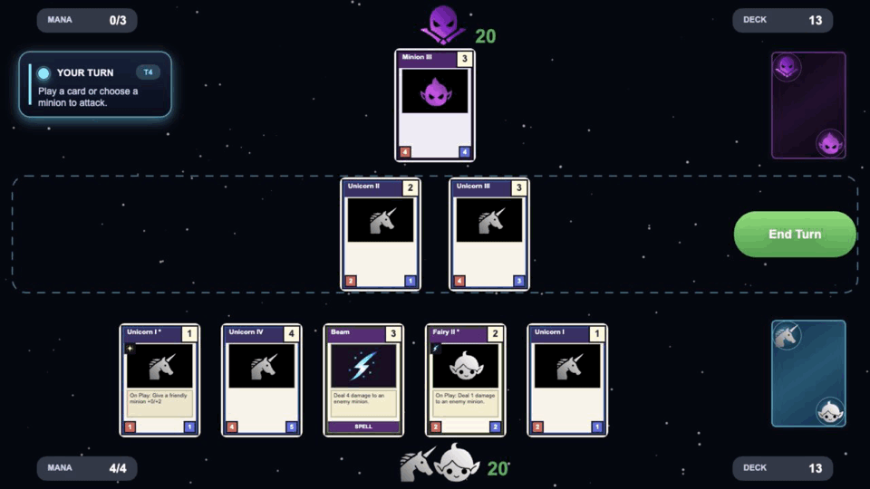
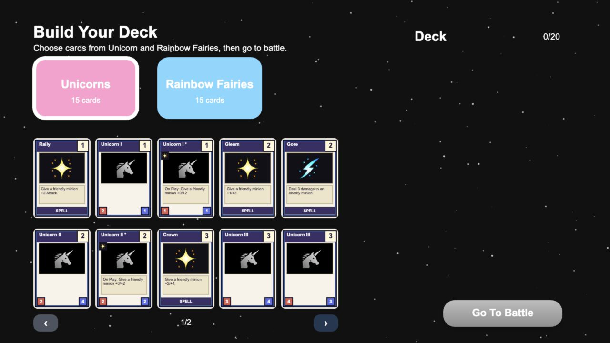
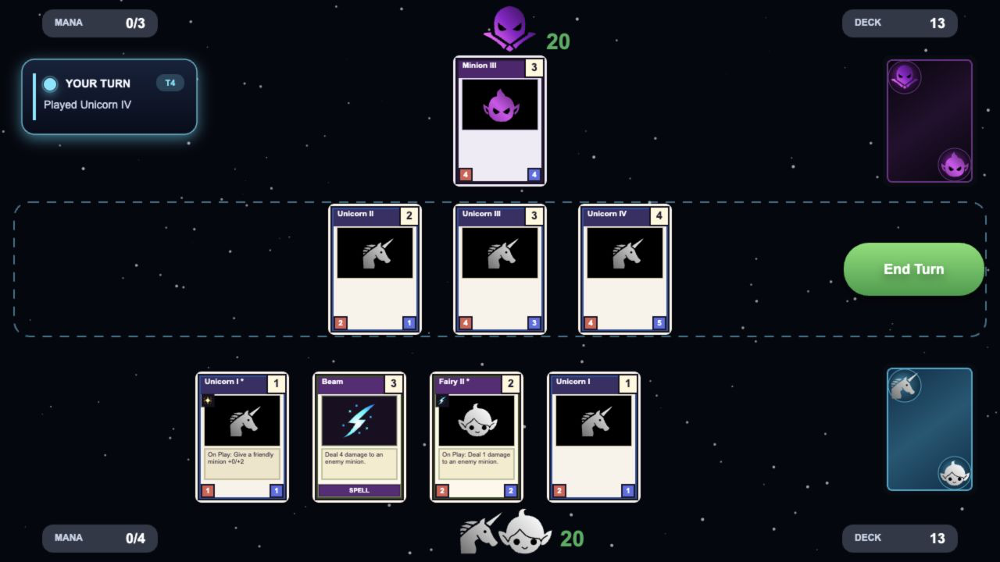

# Color Thief

<p align="center">
  
</p>

Color Thief is a desktop browser card game created for js13kGames 2026 and the
"Unicorns and Rainbows" theme. The Color Thief has drained Chroma of its color;
build a deck of Unicorn and Rainbow Fairy cards to take it back.

<p align="center">
  
</p>

<p align="center">
  
  
</p>

## Gameplay

- Build a 20-card deck from Unicorn and Rainbow Fairy cards.
- Play minions and spells as mana increases during battle.
- Use minions to attack enemy minions and the Color Thief.
- Reduce the Color Thief to 0 HP to win.

## Controls

Color Thief is designed primarily for desktop play.

- `Enter` or `Space`: begin the game and continue after the intro.
- `I`: open Game Info when the current screen is not animating. Press `I` or
  `Escape` to close it.
- Deck building: click a faction, click cards to add them, click an entry in
  the selected deck to remove it, then click **Go To Battle** with 20 cards.
- Mulligan: click opening-hand cards to mark them, then choose **Keep** or
  **Redraw**.
- Battle: drag a spell or minion without a target requirement onto the player
  board. Click a ready minion or a card that needs a target, then click a valid
  target. Click **End Turn** when finished.

## Development

```bash
npm install
npm run dev
```

`npm run dev` serves the source game at `http://localhost:4173`.

Other useful commands:

```bash
npm run debug
npm run build
npm run preview
```

- `npm run debug` starts the development server in the deck-building debug
  state.
- `npm run build` runs the production minification and compression pipeline.
- `npm run preview` serves the current production output locally.

## Build

The production build writes `index.html` and `color-thief.zip` to
`build/prod/`. The ZIP is a build artifact only; the final js13kGames
submission archive is selected manually.

## Credits

Audio uses [ZzFXMicro](https://killedbyapixel.github.io/ZzFX/) v1.3.2 by Frank
Force, released under the MIT License.

## License

This project is available under the [MIT License](LICENSE).
